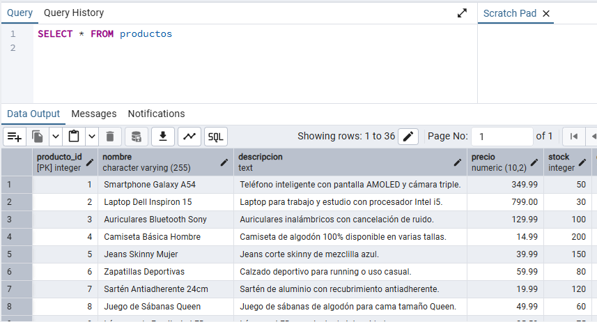
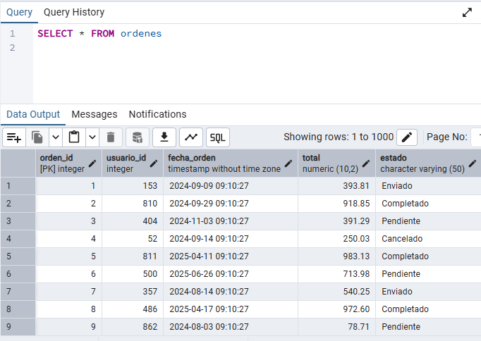
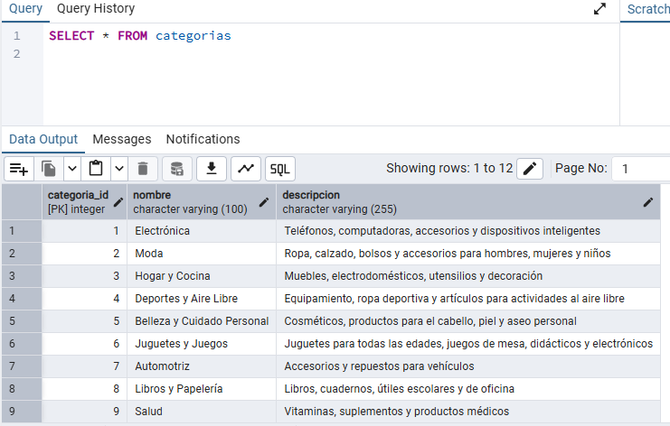
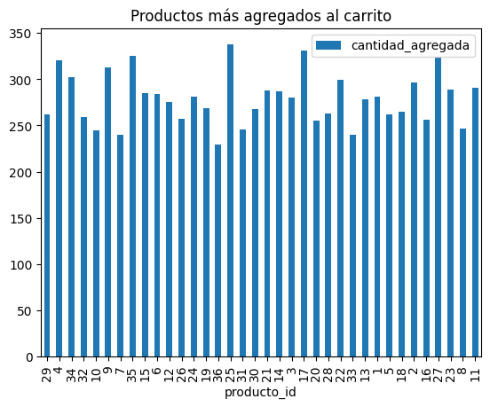
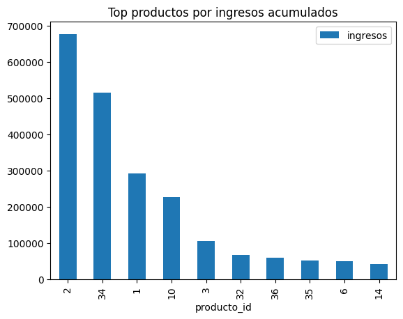
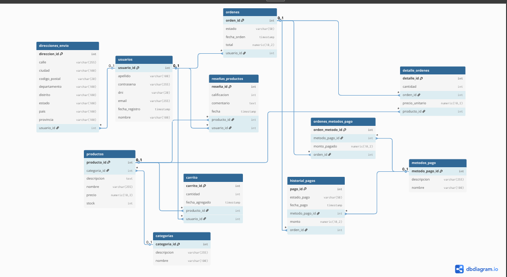
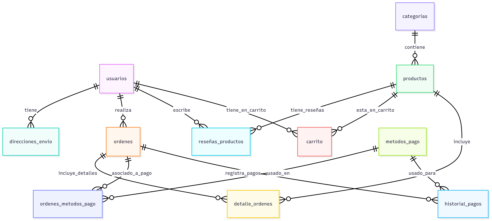

# Módulo ORM (Object-Relational Mapping) y Gestión de Datos

La carpeta `orm/` es el núcleo de la interacción de este proyecto con la base de datos. Contiene los scripts y módulos esenciales para la configuración del entorno de base de datos, la carga inicial de datos, el preprocesamiento, el análisis exploratorio.

## ❓ Preguntas de Negocio

* **¿Cuáles son los ingresos totales por producto y por mes?**
* **¿Cuál es el crecimiento porcentual de las ventas por producto cada mes?** 
* **¿Cuál es la intención de compra (productos agregados al carrito) por producto y por mes?**

## 📈 Avance 1: Configuración, Carga y Calidad de Datos

Este avance se centró en establecer la infraestructura de datos y asegurar la calidad de la información para el análisis posterior.

### 1. Configuración del Entorno de Trabajo

Se ha configurado un sistema de gestión de bases de datos relacional (**PostgreSQL**) para el almacenamiento de los datos del e-commerce.

* **Creación de la Base de Datos:** Se creó una base de datos de trabajo dedicada al proyecto. (`ecommercedb`)

* **Conexión vía ORM:** El módulo [db_conector.py](db_conector.py) encapsula la lógica de conexión a PostgreSQL, utilizando variables de entorno para gestionar las credenciales de forma segura. Esto prepara el entorno para que los scripts de Python interactúen con la base de datos a través de una capa de abstracción (ORM).

### 2. Carga Inicial de Datos

La carga de datos iniciales es un paso crítico para poblar la base de datos con la información cruda del e-commerce.

* **Creación de Tablas:** El script [crear_tablas.py](crear_tablas.py) es responsable de definir el esquema de la base de datos. Este script crea las tablas necesarias en PostgreSQL, basándose en la estructura de los datos de origen.

* **Carga de Datos:** El script [crear_datos.py](crear_datos.py) se encarga de leer los datos proporcionados en archivos los arhivos .sql que se encuentran en la carpeta `orm/sql` e importarlos a las tablas correspondientes en la base de datos.

### 3. Análisis Exploratorio y Evaluación de Calidad de Datos

Se llevó a cabo un exhaustivo análisis exploratorio de datos (EDA) para comprender el contenido y la calidad de la información.

* **Consultas SQL:** Se utilizaron consultas SQL directas para explorar la estructura de las tablas, contar registros, identificar valores únicos y obtener resúmenes básicos.
    * Ejemplo de consultas:
        ```sql
        SELECT * FROM productos;
        SELECT * FROM ordenes;
        SELECT * FROM categorias;
        ```
    * 
    * 
    * 

* **Análisis Jupyter:** Se llevó a cabo también un análisis exploratorio de datos para comprender el contenido y la calidad de la información.
    * Mediante un notebook de Jupyter que está en la carpeta [exploracion_tablas.ipynb](exploracion_tablas.ipynb).
    * **Carrito:** ¿Qué productos se agregan más al carrito?
        
    * **Ingresos:** ¿Qué productos generan más ingresos totales?
        

* **Identificación de Claves:** Detección de claves primarias y foráneas implícitas.
    * **Tablas:**
        * **usuarios:**
            * Clave primaria: `usuario_id`
        * **direcciones_envio:**
            * Clave primaria: `direccion_id`
            * Clave foránea: `usuario_id`
        * **ordenes:**
            * Clave primaria: `orden_id`
            * Clave foránea: `usuario_id`
        * **detalle_ordenes:**
            * Clave primaria: `detalle_id`
            * Clave foránea: `orden_id`
            * Clave foránea: `producto_id`
        * **productos:**
            * Clave primaria: `producto_id`
            * Clave foránea: `categoria_id`
        * **categorias:**
            * Clave primaria: `categoria_id`
        * **reseñas_productos:**
            * Clave primaria: `reseña_id`
            * Clave foránea: `usuario_id`
            * Clave foránea: `producto_id`
        * **carrito:**
            * Clave primaria: `carrito_id`
            * Clave foránea: `usuario_id`
            * Clave foránea: `producto_id`
        * **ordenes_metodos_pago:**
            * Clave primaria: `orden_metodo_id`
            * Clave foránea: `orden_id`
            * Clave foránea: `metodo_pago_id`
        * **metodos_pago:**
            * Clave primaria: `metodo_pago_id`
        * **historial_pagos:**
            * Clave primaria: `pago_id`
            * Clave foránea: `orden_id`
            * Clave foránea: `metodo_pago_id`


## 📊 Avance 2: Modelado Dimensional y Documentación

Este avance se enfocó en el diseño y la documentación del modelo de datos dimensional, crucial para el análisis de KPIs.

### 1. Identificación de Componentes del Modelo Dimensional

El primer paso fue identificar los componentes clave del modelo dimensional, basándose en las preguntas de negocio que el proyecto busca responder.

* **Hechos (Medidas):** Se identificaron las tablas de hechos. 
Ejemplos incluyen: `ordenes`, `historial_pagos`, `carrito`, `reseñas_productos`.

* **Dimensiones (Atributos):** Se determinaron las entidades que proporcionan contexto a los hechos y que servirán como filtros y agrupaciones para el análisis. Ejemplos incluyen: `productos`, `detalle_ordenes`, `métodos_pago`, `ordenes_metodos_pago` .

### 2. Diseño del Modelo de Datos

Diagrama de Entidad-Relación (ERD) del modelo de datos.

s