# Módulo DBT (Data Build Tool)

## 🚀 Propósito del Proyecto dbt

Nuestro proyecto dbt tiene como objetivo principal transformar los datos crudos de e-commerce en un formato limpio, estructurado y optimizado para el análisis de Key Performance Indicators (KPIs).

## 🎯 Objetivos Clave de dbt en este Proyecto

* **Implementar una Arquitectura por Capas (Medallón):** Organizar las transformaciones de datos en etapas claras para mejorar la calidad, la gobernanza y la reusabilidad.
* **Modelar Datos Dimensionalmente:** Crear tablas de hechos y dimensiones optimizadas para consultas analíticas eficientes.
* **Gestionar Cambios Históricos (SCDs):** Capturar y rastrear cambios en atributos de dimensiones clave a lo largo del tiempo.
* **Asegurar la Calidad de Datos:** Implementar pruebas automatizadas para validar la integridad y consistencia de los datos transformados.
* **Generar Documentación y Linaje:** Proporcionar una visión clara del flujo de datos y las dependencias entre los modelos.

## ❓ Preguntas de Negocio

Este proyecto dbt está diseñado para proporcionar las métricas y la estructura de datos necesarias para responder a las siguientes preguntas de negocio clave sobre el rendimiento de los productos en el e-commerce:

* **¿Cuáles son los ingresos totales por producto y por mes?** (Resuelto por `agg_ingresos_productos.sql`)
* **¿Cuál es el crecimiento porcentual de las ventas por producto cada mes?** (Resuelto por `agg_crecimiento_ventas_productos.sql`)
* **¿Cuál es la intención de compra (productos agregados al carrito) por producto y por mes?** (Resuelto por `agg_intencion_compra_productos.sql`)

Estas métricas se consolidan en el modelo `rpt_analisis_productos_kpis.sql` para su fácil consumo.

## 📊 Capas de Datos y Decisiones de Diseño

Hemos implementado una **arquitectura por capas tipo Medallón** (Bronze, Silver, Gold) para organizar nuestras transformaciones. Esta decisión se basa en las siguientes ventajas:

* **Claridad y Gobernanza:** Cada capa tiene un propósito bien definido, lo que facilita la comprensión del flujo de datos y la asignación de responsabilidades.
* **Reusabilidad:** Los datos transformados en una capa pueden ser reutilizados por múltiples modelos en capas superiores o por diferentes consumidores.
* **Calidad de Datos Incrementada:** La limpieza y validación se realizan progresivamente a medida que los datos avanzan a través de las capas.
* **Rendimiento:** Las agregaciones complejas se precalculan en la capa Gold, optimizando el rendimiento para las consultas de los dashboards.

### 1. Capa `bronze/` (Staging)

* **Propósito:** Esta capa actúa como un área de preparación para los datos crudos. Los modelos aquí son, en su mayoría, vistas que apuntan directamente a las fuentes de datos originales en la base de datos (PostgreSQL).
* **Decisiones de Diseño:**
    * **Definición de Fuentes (`sources.yml`):** Utilizamos `sources.yml` para declarar explícitamente las tablas de origen de nuestra base de datos. Esto permite a dbt entender el linaje desde el inicio y nos proporciona un punto de partida claro para las dependencias.

    * **Scripts:**
        * [stg_carrito.sql](models/bronze/stg_carrito.sql)
        * [stg_ordenes.sql](models/bronze/stg_ordenes.sql)
        * [stg_productos.sql](models/bronze/stg_productos.sql)
        * [stg_usuarios.sql](models/bronze/stg_usuarios.sql)
        * [stg_categorias.sql](models/bronze/stg_categorias.sql)
        * [stg_detalle_ordenes.sql](models/bronze/stg_detalle_ordenes.sql)
        * [stg_direcciones_envio.sql](models/bronze/stg_direcciones_envio.sql)
        * [stg_historial_pagos.sql](models/bronze/stg_historial_pagos.sql)
        * [stg_metodos_pago.sql](models/bronze/stg_metodos_pago.sql)
        * [stg_reseñas_productos.sql](models/bronze/stg_reseñas_productos.sql)
        * [stg_ordenes_metodos_pago.sql](models/bronze/stg_ordenes_metodos_pago.sql)

### 2. Capa `silver/` (Transformación Intermedia y Modelado Dimensional)

* **Propósito:** Aquí es donde los datos crudos se limpian, se normalizan y se transforman en tablas de hechos y dimensiones. Esta capa es fundamental para construir un modelo de datos dimensional robusto.
* **Decisiones de Diseño:**
    * **Limpieza y Normalización:** Se aplican reglas de negocio para limpiar datos inconsistentes, manejar valores nulos y estandarizar formatos.
    * **Construcción de Dimensiones:**
        * **[dim_productos.sql](models/silver/dim_productos.sql):** Este modelo crea la tabla de dimensión de productos, consolidando atributos descriptivos como nombre, descripción y categoría.
        * **[dim_categorias.sql](models/silver/dim_categorias.sql):** Similarmente, este modelo crea la dimensión de categorías, proporcionando el contexto descriptivo para las categorías de productos.
        * **[dim_usuarios.sql](models/silver/dim_usuarios.sql):** Este modelo crea la dimensión de usuarios, proporcionando información sobre los usuarios que realizan transacciones en la plataforma.
        * **Justificación:** Separar las dimensiones de los hechos mejora la legibilidad de las consultas, reduce la redundancia de datos y facilita la implementación de Slowly Changing Dimensions (SCDs).
    * **Construcción de Tablas de Hechos:**
        * **[fact_carritos.sql](models/silver/fact_carritos.sql)**:
            Contiene métricas granulares relacionadas con la intención de compra (ej., cantidad de productos agregados al carrito, fecha de adición).
        * **[fact_ordenes.sql](models/silver/fact_ordenes.sql)**:
            Registra los eventos de órdenes, incluyendo métricas como el total de la orden y las claves foráneas a las dimensiones relevantes (ej., usuario, fecha).
        * **Justificación:** Las tablas de hechos son el centro del análisis, almacenando las medidas cuantitativas y las claves foráneas a las dimensiones, lo que permite un análisis flexible y multidimensional.
        Se decidió dejar como tipo view todas las tablas de esta capa

### 3. Capa `gold/` (Presentación y KPIs)

* **Propósito:** Esta es la capa de consumo, donde los datos se agregan y se preparan específicamente para el consumo por herramientas de Business Intelligence (BI) y el dashboard de Streamlit. Los modelos aquí son las métricas y reportes finales.
* **Decisiones de Diseño:**
    * **Agregaciones Precalculadas:**
        * [agg_crecimiento_ventas_productos.sql](models/gold/agg_crecimiento_ventas_productos.sql)
        * [agg_ingresos_productos.sql](models/gold/agg_ingresos_productos.sql)
        * [agg_intencion_compra_productos.sql](models/gold/agg_intencion_compra_productos.sql)
        * **Justificación:** Separar estas agregaciones permite que cálculos complejos se realicen una sola vez y se almacenen. Esto mejora drásticamente el rendimiento del dashboard, ya que solo necesita consultar estas tablas precalculadas en lugar de recalcular las métricas sobre grandes volúmenes de datos en cada interacción. También fomenta la reusabilidad de estas métricas en otros contextos.
    * **Reporte Final ([rpt_analisis_productos_kpis.sql](models/gold/rpt_analisis_productos_kpis.sql)):**
        * Este modelo consolida todas las métricas clave de los modelos `agg_` en una única tabla final.
        * **Justificación:** Proporciona una "única fuente de verdad" para el dashboard de Streamlit. El dashboard solo necesita consultar esta tabla, simplificando su lógica y optimizando el rendimiento al evitar múltiples JOINs complejos en tiempo de ejecución. Esta tabla está diseñada específicamente para las necesidades de presentación del dashboard.
        Tambien se decidio materializar la tabla de KPIs en la capa `gold` para que el dashboard pueda consultarla directamente.

## 🕰️ Gestión de Cambios Históricos con Snapshots (SCD Type 2)

El directorio `snapshots/` es fundamental para implementar **Slowly Changing Dimensions (SCDs)**, específicamente el **Tipo 2**. Esta decisión se tomó para permitir un análisis histórico preciso de los atributos de las dimensiones que pueden cambiar con el tiempo (ej., el precio de un producto, la descripción de una categoría).

* **Propósito:** Un snapshot captura y registra los cambios en los atributos de una dimensión. Cuando un valor cambia, dbt no actualiza la fila existente, sino que crea una nueva fila con el nuevo valor y un nuevo período de validez. La fila anterior se marca como "expirada".
* **[snapshot_productos.sql](snapshots/productos_historico.sql):** Este archivo define cómo se monitorea la dimensión de productos para cambios. Por ejemplo, si el precio o la descripción de un producto cambian, el snapshot registrará una nueva versión de ese producto en la tabla de snapshot.
* **[snapshot_categorias.sql](snapshots/categorias_historico.sql):** Este archivo define cómo se monitorea la dimensión de categorías para cambios. Por ejemplo, si la descripción de una categoría cambia, el snapshot registrará una nueva versión de esa categoría en la tabla de snapshot.
* **Justificación:** Sin SCDs Tipo 2, si el precio de un producto cambiara, el análisis de ventas históricas de ese producto usaría siempre el precio actual, distorsionando los ingresos pasados. Con SCDs Tipo 2, podemos consultar el precio exacto del producto en el momento de cada venta, lo que es crucial para la precisión de los KPIs históricos.
* **Ejecución:** Los snapshots se ejecutan con el comando `dbt snapshot`.

## Macros de dbt

Macros de dbt se encuentran en la carpeta `macros/`. Estas macros se pueden utilizar en los modelos de datos para realizar pruebas de criterios de negocio y validaciones de datos.

El macro implementado es un test personalizado que verifica si una expresión SQL dada es verdadera para todas las filas de un modelo. Es útil para aplicar condiciones de negocio específicas o validaciones de datos complejas.

* **Script**: implentación de un test personalizado
    * [mi_custom_tests.sql](macros/mi_custom_tests.sql)
* **Ejemplo de uso**: un ejemplo de uso de donde se aplica esta macro
        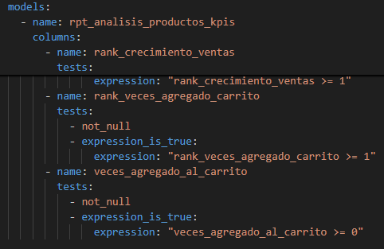

### Análisis de Grafos en la Documentación de dbt (Lineage Graph)

La documentación generada por dbt es una herramienta interactiva invaluable para comprender la estructura y el flujo de datos de nuestro proyecto. Una de sus características más potentes es el **Gráfico de Linaje (Lineage Graph)**.

* **Propósito:** Este gráfico visualiza las dependencias entre todos los componentes de nuestro pipeline de datos: desde las fuentes de datos (`sources`) en la capa `bronze`, pasando por los modelos de transformación (`silver` y `gold`) y las flechas indican la dirección del flujo de datos (de dónde provienen los datos y a dónde van).

* **Valor Analítico y su Relación con Nuestra Estructura:**
    * **Visibilidad de la Capa Bronze:** El gráfico de linaje te permite ver claramente cómo los modelos de staging (ej., `stg_carrito`, `stg_productos`) se conectan directamente a las fuentes de datos definidas en `sources.yml`. Esto establece el punto de partida de nuestro pipeline.
    * **Flujo a la Capa Silver:** Podrás observar cómo los modelos de la capa `silver` (como `fact_carritos.sql`, `fact_ordenes.sql`, `fact_productos.sql`, y las dimensiones `dim_productos`, `dim_categorias.sql`, `dim_usuarios.sql` dependen de los modelos `stg_` de la capa `bronze`. Esto ilustra visualmente la limpieza y normalización de los datos crudos.
    * **Consolidación en la Capa Gold:** El gráfico destacará cómo los modelos de agregación `agg_crecimiento_ventas_productos.sql`, `agg_ingresos_productos.sql`, `agg_intencion_compra_productos.sql` consumen los datos de la capa `silver`. 
    Más importante aún, verás cómo el modelo final de reporte, `rpt_analisis_productos_kpis.sql`, se nutre directamente de estas agregaciones precalculadas, demostrando la eficiencia del diseño para el consumo de BI.   
    * **Impacto de Snapshots:** Los modelos de snapshot (ej., `snapshot_productos.sql`, `snapshot_categorias.sql` aparecerán en el grafo, mostrando cómo se bifurca el linaje para capturar el historial de las dimensiones.

* **Visualización:**
    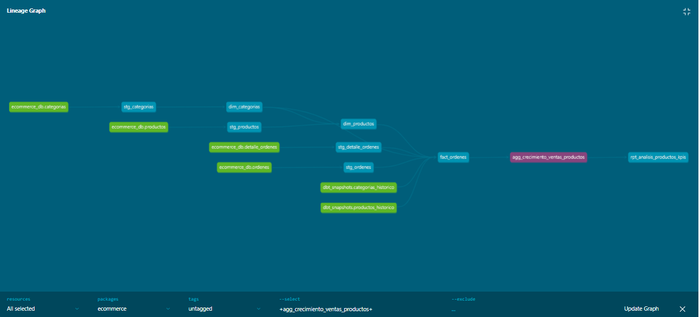
    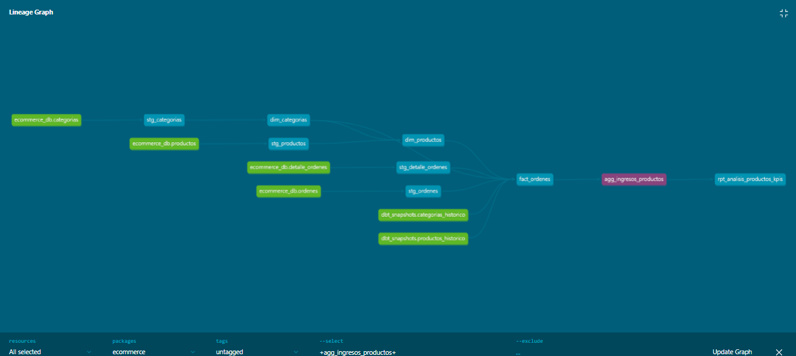
    
    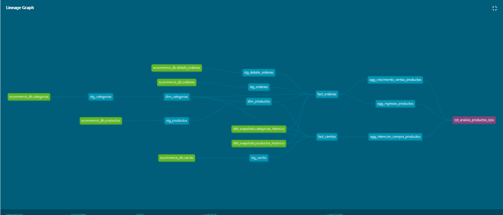

### Integración con Streamlit: Dashboard de KPIs

Nuestro dashboard interactivo, construido con Streamlit, es la capa de presentación que consume directamente los datos transformados por dbt. Está diseñado para proporcionar una interfaz de usuario intuitiva para explorar los KPIs clave del e-commerce. (respondiendo las preguntas de negocio propuestas)

* **Consumo Directo de la Capa Gold:** El dashboard se conecta a la base de datos y consulta el modelo [rpt_analisis_productos_kpis.sql](models/gold/rpt_analisis_productos_kpis.sql) de la capa `gold`. Esta decisión asegura que el dashboard siempre trabaje con datos limpios, agregados y optimizados para el rendimiento.
* **Visualización de KPIs Clave:** El dashboard presenta gráficos y tablas que responden a las preguntas de negocio establecidas, como ingresos por producto, crecimiento de ventas y productos con mayor intención de compra mensual.
    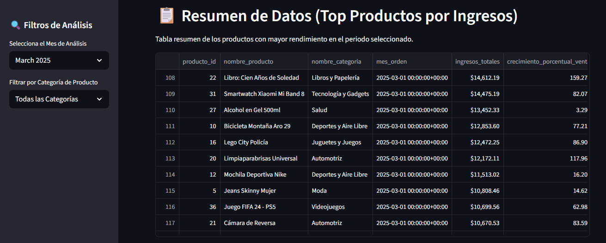
    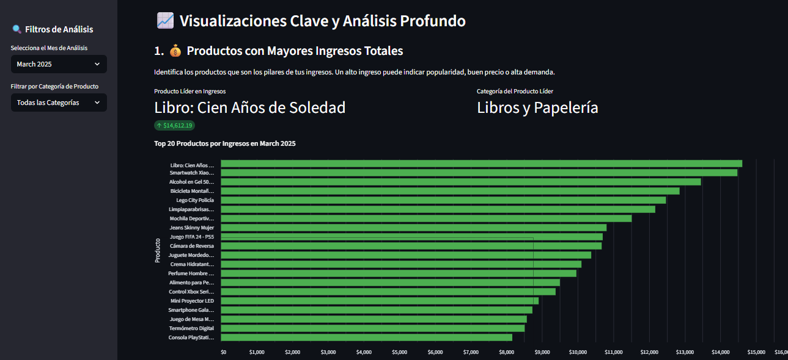
    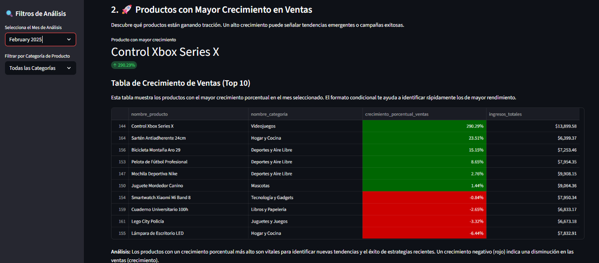
    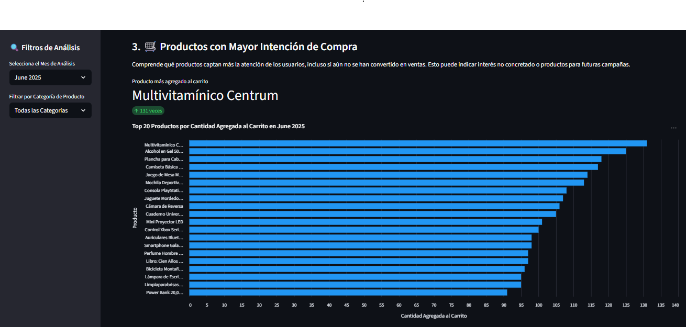
    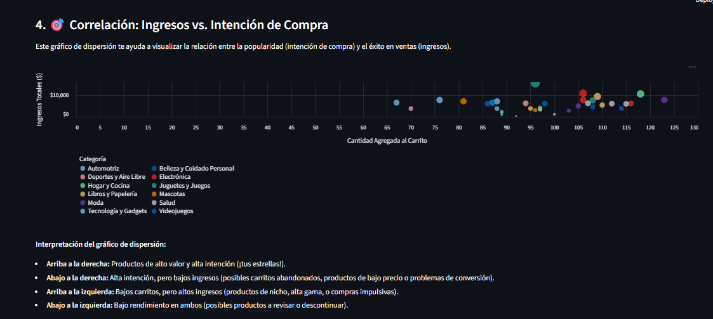
    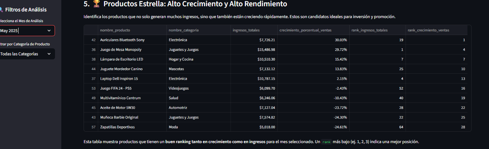
    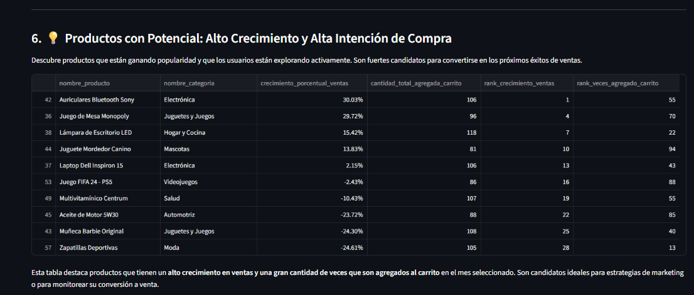